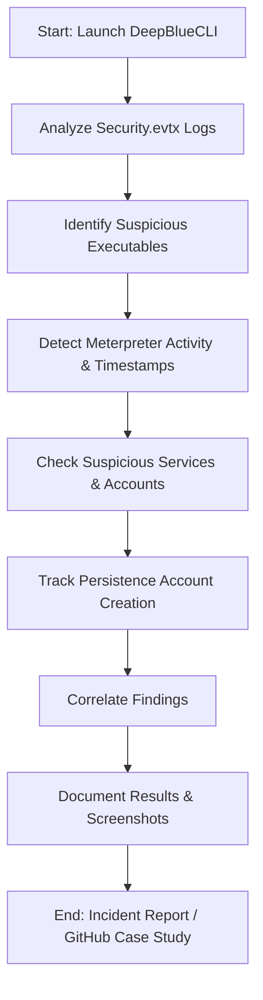

# SIEM-Log-Analysis-Case-Study
A hands-on SIEM log analysis and incident response mini-case study. Investigates a compromised Windows system using DeepBlueCLI, documenting suspicious activity, malicious executables, persistence accounts, and SOC-style findings with screenshots and commands.

# SIEM-Log-Analysis-Case-Study

## Project Objectives
Perform a SIEM log analysis and incident response mini-case study on a Windows system compromised with a Meterpreter reverse shell. Investigate logs, identify malicious activity, and document the process like a SOC report.

---

## Implemented Solutions / Investigation Steps
- Opened terminal in the lab environment.
- Ran DeepBlueCLI:
```bash
./DeepBlue.ps1 ../security.evtx
```
- Analyzed recovered Security logs (Security.evtx).
- Tracked suspicious services, executables, and account activity.
- Recorded timestamps of malicious activity.

---

## SOC Report Workflow


