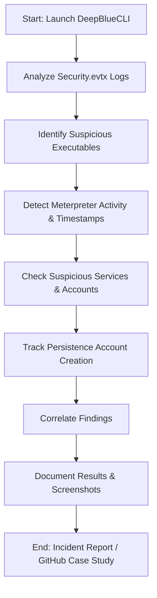

# SIEM-Log-Analysis-Case-Study
A hands-on SIEM log analysis and incident response mini-case study. Investigates a compromised Windows system using DeepBlueCLI, documenting suspicious activity, malicious executables, persistence accounts, and SOC-style findings with screenshots and commands.

# SIEM-Log-Analysis-Case-Study

## Project Objectives
Perform a SIEM log analysis and incident response mini-case study on a Windows system compromised with a Meterpreter reverse shell. Investigate logs, identify malicious activity, and document the process like a SOC report.

---

## Implemented Solutions / Investigation Steps
- Opened terminal in the lab environment.
- Ran DeepBlueCLI:
```bash
./DeepBlue.ps1 ../security.evtx
```
- Analyzed recovered Security logs (Security.evtx).
- Tracked suspicious services, executables, and account activity.
- Recorded timestamps of malicious activity.

---

## SOC Report Workflow

## Commands and Queries
| Step | Command / Query | Purpose |
|------|-----------------|---------|
| 1 | `./DeepBlue.ps1 ../security.evtx` | Open Security.evtx and list executed processes |
| 2 | Search for “Metasploit” in output | Identify Meterpreter activity timestamp |
| 3 | Examine service creation events | Detect suspicious service (rztbzn) |
| 4 | Filter process creation events between 10:30–10:50 | Identify malicious executable (serviceupdate.exe) |
| 5 | Look at user creation events between 11:25–11:40 | Find command used to create persistent account (`net user ServiceAct /add`) |
| 6 | Check group membership for new account | Identify local groups: Administrators, Remote Desktop Users |

## Questions and Answers

# Incident Response Findings

## 1️⃣ Which user account ran GoogleUpdate.exe?  
**Answer:** Mike Smith  

📷   

*Screenshot of DeepBlueCLI output showing user account execution of GoogleUpdate.exe.*  

---

## 2️⃣ Evidence of Meterpreter activity?  
**Answer:** 04/10/2021 10:48:14 AM  

📷   

*Screenshot showing the log entry indicating Meterpreter activity.*  

3️⃣ Name of the suspicious service created?
Answer: rztbzn
📷 
Screenshot of DeepBlueCLI output showing the suspicious service.
4️⃣ Malicious executable used for reverse shell?
Answer: serviceupdate.exe (associated with Mike Smith)
📷 
Screenshot showing the downloaded executable used to gain reverse shell.
5️⃣ Command line used to create additional persistence account?
Answer: net user ServiceAct /add
📷 
Screenshot showing the command that created the additional account for persistence.
