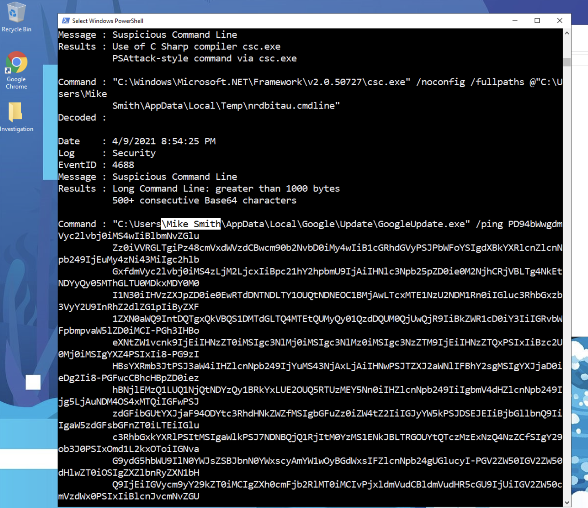
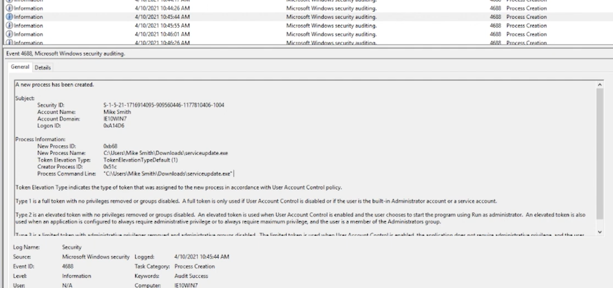
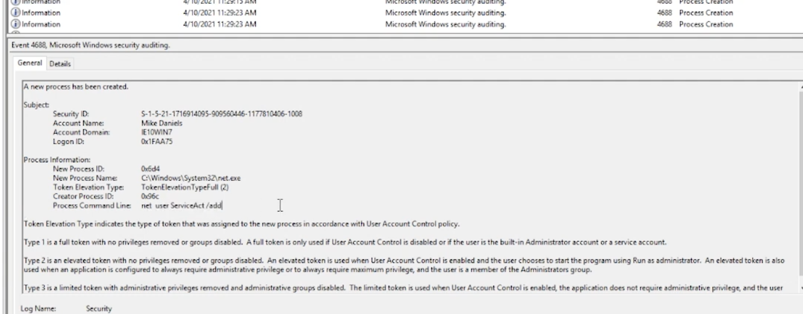

# SIEM-Log-Analysis-Case-Study
A hands-on SIEM log analysis and incident response mini-case study. Investigates a compromised Windows system using DeepBlueCLI, documenting suspicious activity, malicious executables, persistence accounts, and SOC-style findings with screenshots and commands.

# SIEM-Log-Analysis-Case-Study

## Project Objectives
Perform a SIEM log analysis and incident response mini-case study on a Windows system compromised with a Meterpreter reverse shell. Investigate logs, identify malicious activity, and document the process like a SOC report.

---

## Implemented Solutions / Investigation Steps
- Opened terminal in the lab environment.
- Ran DeepBlueCLI:
```bash
./DeepBlue.ps1 ../security.evtx
```
- Analyzed recovered Security logs (Security.evtx).
- Tracked suspicious services, executables, and account activity.
- Recorded timestamps of malicious activity.

---

## SOC Report Workflow

## Commands and Queries
| Step | Command / Query | Purpose |
|------|-----------------|---------|
| 1 | `./DeepBlue.ps1 ../security.evtx` | Open Security.evtx and list executed processes |
| 2 | Search for ‚"Metasploit"‚ in output | Identify Meterpreter activity timestamp |
| 3 | Examine service creation events | Detect suspicious service (rztbzn) |
| 4 | Filter process creation events between 10:30‚ 10:50 | Identify malicious executable (serviceupdate.exe) |
| 5 | Look at user creation events between 11:25‚ 11:40 | Find command used to create persistent account (`net user ServiceAct /add`) |
| 6 | Check group membership for new account | Identify local groups: Administrators, Remote Desktop Users |

## Questions and Answers

# Incident Response Findings

## 1️⃣ Which user account ran GoogleUpdate.exe?

**Answer:** `Mike Smith`

**Screenshot:**  
📷

Screenshot of DeepBlueCLI output showing user account execution of GoogleUpdate.exe.

---

## 2️⃣ Evidence of Meterpreter activity?

**Answer:** `04/10/2021 10:48:14 AM`

**Screenshot:**  


Screenshot showing the log entry indicating Meterpreter activity.

### 3️⃣ Name of the suspicious service created?

**Answer:** `rztbzn`

**Screenshot:**  


Screenshot of DeepBlueCLI output showing the suspicious service.

### 4️⃣ Malicious executable used for reverse shell?

**Answer:** `serviceupdate.exe` (associated with Mike Smith)

**Screenshot:**  
📷

Screenshot showing the downloaded executable used to gain reverse shell.

### 5️⃣ Command line used to create additional persistence account?

**Answer:** `net user ServiceAct /add`

**Screenshot:**  
📷

Screenshot showing the command that created the additional account for persistence.

## Findings / Incident Summary
- **Compromised user:** Mike Smith
- **Malicious executable:** serviceupdate.exe
- **Suspicious service:** rztbzn
- **New persistence account:** ServiceAct
- **Meterpreter activity timestamp:** 04/10/2021 10:48:14 AM

The attacker used a reverse shell, created additional accounts and services to maintain persistence, and attempted data exfiltration. Logs clearly indicate the time, method of compromise, and affected accounts.

---

## Lessons Learned
- DeepBlueCLI makes SIEM log analysis straightforward for incident response.
- Real SOC investigations require correlating logs, executables, services, and account activity.
- Documenting screenshots, commands, and findings is critical for SOC reporting and creating a professional GitHub case study.
